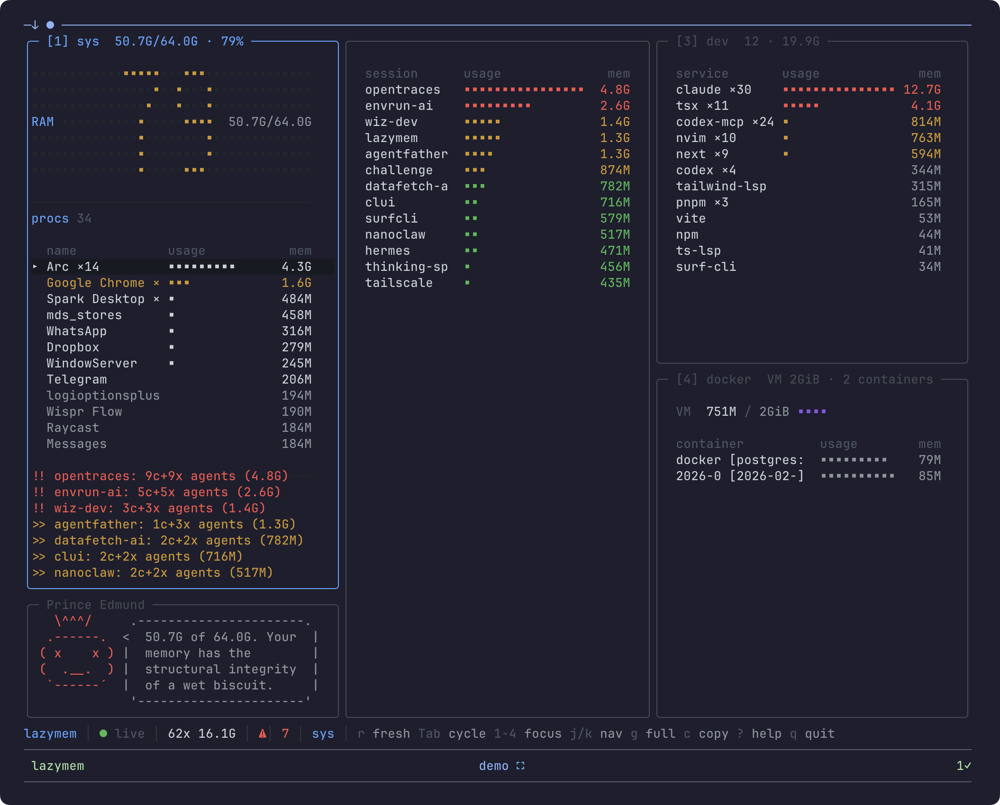

```
 _                    __  __                
| |    __ _ _____   _|  \/  | ___ _ __ ___  
| |   / _` |_  / | | | |\/| |/ _ \ '_ ` _ \ 
| |__| (_| |/ /| |_| | |  | |  __/ | | | | |
|_____\__,_/___|\__, |_|  |_|\___|_| |_| |_|
                |___/                        
```

If you're running multiple Claude/Codex agents across tmux sessions, a handful of dev servers, and Docker containers on the side, your Mac's memory disappears fast. lazymem gives you a single dashboard to see where it's all going, and an agent-native way to clean it up.



The OpenTUI implementation stays in-tree for parity work and benchmarking. The user-facing release story is now Rust-first.

## What it does

- **System panel** - RAM breakdown (app, wired, compressor, cached, swap), top processes, anomaly alerts
- **Agent panel** - Claude and Codex instances grouped by tmux session, with per-session memory totals
- **Dev panel** - Node, Bun, Python, LSPs, and other dev processes grouped by type
- **Docker panel** - Container stats, Colima VM allocation vs actual use
- **Prince Edmund** - An animated companion who comments on your memory situation (contextual to live state)

## Agent-native memory management

lazymem is designed to work alongside AI coding agents. Press `c` to copy a structured snapshot to your clipboard, then paste it into Claude Code. The snapshot includes PIDs, session mappings, and memory values your agent can act on directly.

For a fully integrated workflow, install the companion skill:

```sh
mkdir -p ~/.claude/skills/lazymem
cp ~/.lazymem/skill/SKILL.md ~/.claude/skills/lazymem/SKILL.md
```

If you installed via Homebrew instead of the curl installer, copy from:

```sh
cp "$(brew --prefix lazymem)/share/lazymem/skill/SKILL.md" ~/.claude/skills/lazymem/SKILL.md
```

Then use `/lazymem` in Claude Code to:
- Collect live memory state across all your sessions
- Identify which agents and dev servers are using the most RAM
- Kill idle agents, stop containers, or purge cache with confirmation prompts
- See before/after memory deltas after each operation

The skill can also parse lazymem snapshots directly, so you don't need to wait for a fresh collection.

## Install

### Homebrew

```sh
brew tap JayFarei/tap
brew install lazymem
```

### cargo

Install directly from git:

```sh
cargo install --git https://github.com/JayFarei/lazymem --locked lazymem-rs
```

This installs the `lazymem` binary from the Rust crate in this repository.

`cargo install` only installs the binary. If you also want the bundled Claude skill assets, use the Homebrew or curl install path instead.

If you want the local Rust install path for benchmark or parity work:

```sh
cargo install --path src-rust
```

### curl

```sh
curl -fsSL https://raw.githubusercontent.com/JayFarei/lazymem/main/install.sh | sh
```

### From source (Rust)

```sh
cargo build --release --manifest-path src-rust/Cargo.toml
./src-rust/target/release/lazymem
```

## Benchmark

Latest head-to-head benchmark snapshot:

- latency: RatatUI reached `core ready` in `315 ms` vs `376 ms`, and `full ready` in `526 ms` vs `611 ms`
- main-process memory: RatatUI used `4.7 MB` RSS at full ready vs `244.5 MB`, and `7.0 MB` after idle vs `263.8 MB`

Report:

- [benchmark/report.md](benchmark/report.md)

Underlying summaries:

- `benchmark/results/latest-head-to-head.md`
- `benchmark/results/latest-opentui.json`
- `benchmark/results/latest-ratatui.json`

The benchmark harness and tracked scorecard live under `benchmark/`.

## Keybindings

| Key | Action |
|-----|--------|
| `q` | Quit |
| `c` | Copy snapshot to clipboard |
| `Tab` | Cycle panels |
| `1-4` | Jump to panel |
| `j/k` | Navigate rows |
| `Enter` | Expand row details |
| `g` | Fullscreen panel |
| `r` | Force refresh |
| `?` | Help overlay |

## Requirements

- macOS (uses `vm_stat`, `sysctl`, `ps` with macOS-specific flags)
- Bun only if you are developing or benchmarking the legacy OpenTUI implementation
- Rust only if you are building the RatatUI binary from source

## License

MIT
